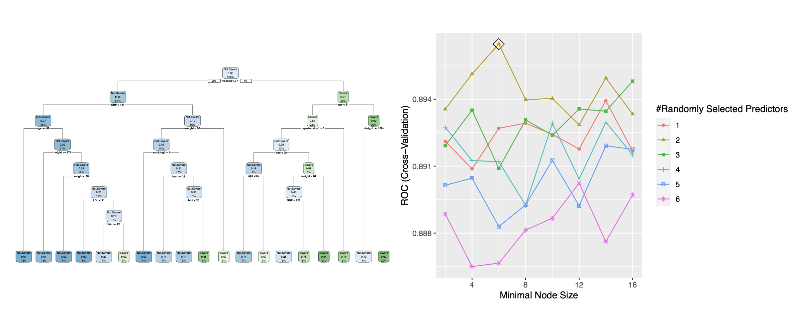

```{r, include=FALSE}
library(dplyr)
library(ggplot2)
```

```{r, include=FALSE}
load("severity_test.RData")
load("severity_training.RData")

test_data <- test_data %>%
  dplyr::select(-id) %>%
  mutate(
    gender = case_when(gender == 0 ~ "Female",
                     gender == 1 ~"Male"),
    race = case_when(race == 1 ~ "White",
                     race == 2 ~ "Asian",
                     race == 3 ~ "Black",
                     race == 4 ~ "Hispanic"),
  ) %>%
  mutate(
    gender = as.factor(gender),
    diabetes = as.factor(diabetes),
    hypertension = as.factor(hypertension),
    vaccine = as.factor(vaccine),
    severity = factor(severity, levels = c(1, 0), labels = c("Severe", "Not Severe"))
  )

training_data <- training_data %>%
  dplyr::select(-id) %>%
  mutate(
    gender = case_when(gender == 0 ~ "Female",
                     gender == 1 ~"Male"),
    race = case_when(race == 1 ~ "White",
                     race == 2 ~ "Asian",
                     race == 3 ~ "Black",
                     race == 4 ~ "Hispanic"),
  ) %>%
  mutate(
    gender = as.factor(gender),
    diabetes = as.factor(diabetes),
    hypertension = as.factor(hypertension),
    vaccine = as.factor(vaccine),
    severity = factor(severity, levels = c(1, 0), labels = c("Severe", "Not Severe"))
  )
```

# Exploratory Analysis and Data Visualization
## Data Summary
This dataset has no missing values and there are 13 potential predictors: 7 of them are numeric variables (including `age`, `height`, `weight`, `bmi`, `SBP`, `LDL`, and `depression`), and the remaining 6 are categorical variables (including `gender`, `race`, `smoking`, `diabetes`, `hypertension` and `vaccine`). The response variable `severity` has two values: 1 stands for severe status (286 observations) and 0 stands for non-severe status (514 observations).

## Multivariate Density Plot of Age by Severity, Gender, and Race

From the figure on the left, it is evident that severity of COVID-19 tends to be higher among older individuals overall. However, specific trends vary across different demographic groups. Notably, the severity appears less pronounced among Female Black, Female Hispanic, and Male Asian populations. This suggests that factors beyond age, such as gender and race, may play a role in determining the severity of COVID-19 symptoms.


## Severity Proportion by Vaccine Status
From the figure on the right, it is apparent that the severity of COVID-19 is lower among individuals who have received the vaccine. From our data, it can be reasonably concluded that vaccination is targeted at mitigating the symptoms of COVID-19.

# Model Training
We employed a variety of models for classification tasks, including Penalized Logistic Regression, Linear Discriminant Analysis, Quadratic Discriminant Analysis, Naive Bayes, Classification Trees, Random Forests, AdaBoost, and Support Vector Machine. This report will showcase essential visualizations of parameter selection processes within each algorithm, while detailed predictions and additional information for each model can be referenced from the code.

## Penalized Logistic Regression
Penalized Logistic Regression assumes a linear relationship between the log odds of the outcome and the predictor variables, penalizing large coefficient values to prevent overfitting. The following plot on the right displays the performance of the glmnet model across different values of the regularization parameters alpha and lambda through cross-validation.


## Linear Discriminant Analysis
Linear Discriminant Analysis assumes that the predictor variables follow a multivariate normal distribution and that the classes have equal covariance matrices. The above plot on the right visualizes the separation between classes and the projection of data points onto the linear discriminant function in the Linear Discriminant Analysis model.


## Quadratic Discriminant Analysis
Quadratic Discriminant Analysis assumes that the predictor variables follow a multivariate normal distribution, allowing for different covariance matrices for each class.

## Naive Bayes
Naive Bayes assumes that the predictor variables are conditionally independent given the class labels. The following plot on the left illustrates the performance of the Naive Bayes model across various settings of the kernel function and Laplace smoothing parameter through cross-validation.


## Classification Trees
Classification Trees divides the predictor space into regions based on the values of the predictor variables, aiming to create homogeneous regions with respect to the outcome. The above plot on the right visualizes the performance of the Classification Tree (rpart) model across different complexity parameters (cp), demonstrating their impact on the model's ROC metric through cross-validation. By this way, we can select a final model shown as the following plot on the left.



## Random Forests
Random Forests constructs multiple decision trees using bootstrapped samples of the data and random subsets of the predictor variables, combining their predictions to reduce overfitting. The above plot on the right illustrates the performance of the Random Forest (ranger) model across different hyperparameters, highlighting the optimal parameter combinations through cross-validation.


## AdaBoost
AdaBoost sequentially fits multiple weak learners to the data, assigning higher weights to misclassified observations to improve predictive performance. The following plot on the left visualizes the performance of the Gradient Boosting Machine (gbm) model across different hyperparameters, highlighting the optimal parameter combinations based on the ROC metric evaluated through cross-validation.


## Support Vector Machine
Support Vector Machine constructs a hyperplane or set of hyperplanes in a high-dimensional space to separate the classes with the maximum margin, or finds the optimal decision boundary by maximizing the margin between the closest data points of different classes. And the above plot on the right illustrates the performance of the Support Vector Machine (SVM) model with a radial kernel across different values of the cost parameter (C) and the kernel width parameter (sigma), highlighting optimal parameter combinations based on evaluation through cross-validation.


# Results
After comparing models using resampling and evaluating performance with ROC curves from the following plots, Boosting (gbmA), Support Vector Machine with Radial Basis Function Kernel (svmr), and Random Forest (rf) emerged as the top performers. This trend persisted on the test dataset to some extent, where gbmA, svmr, and Naive Bayes (nb) excelled. Consequently, we will proceed with utilizing the Boosting model for further analysis and predictions.


# Conclusions
AdaBoost algorithm exhibits several notable advantages compared to other models. It demonstrates excellent performance in handling imbalanced datasets, effectively manages noisy data, and is less prone to overfitting. Additionally, AdaBoost automatically selects important features, simplifying the feature selection process and enhancing model interpretability.

Furthermore, we compared Variable Importance plots and Partial Dependence Plots and found that the vaccine significantly influences disease severity, consistent with our earlier findings in the data visualization section. Moreover, systolic blood pressure (sbp) and height also exhibit important positive or negative effects. These findings hold significant implications for future disease prevention and intervention efforts, aiding in a better understanding of disease mechanisms and facilitating the development of targeted preventive measures.


